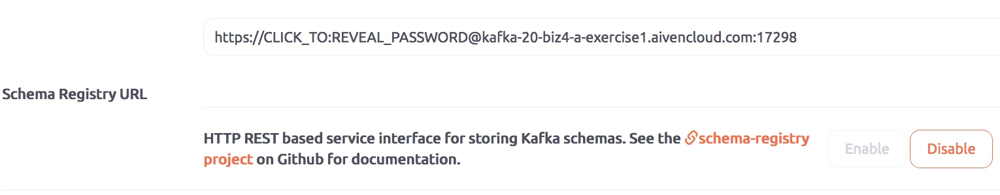

Kafka Streams with Aiven for Kafka
==================================

Kafka streams and streams API allows for streaming data through the
heart of Kafka, the brokers. The data that passes through the brokers
has a key-value structure. As this data enters the brokers, it is
serialized by the streams API to a byte array, and as it exits the
brokers it is de-serialized back to the original key-value structure,
again by the streams API. Kafka streams also allows for transformation
of data that enters the brokers in real-time, and feed the transformed
data back into Kafka as another, transformed stream of data. This makes
Kafka streams quite a powerful concept in terms of the many use cases it
can address in the world of real-time data processing and analysis.

This help article explores how to realize Kafka streams with Aiven for
Kafka and Schema registry.

**Note:** As of version 3.0, Aiven for Apache Kafka no longer supports
Confluent Schema Registry. For more information, see `this article that
describes the replacement,
Karapace <https://help.aiven.io/en/articles/5651983>`__ .

The article is divided into the following parts:

-  Creating an Aiven for Kafka service

-  Modifying the KafkaMusicExample application to work with Aiven for
   Kafka and Schema registry

Creating an Aiven for Kafka service is documented in the “ `Getting
started with Aiven for
Kafka <https://help.aiven.io/kafka/getting-started-with-aiven-kafka>`__
” help article. After creating the Kafka service, please create topics
“play-events” and “song-feed” via the Aiven console.

The following information will be required in the configuration process:

-  Kafka service's service URL

-  Schema Registry URL (URL without the username and password), username
   and password from the Kafka service

Modifying the KafkaMusicExample to work with Aiven for Kafka and Schema registry
--------------------------------------------------------------------------------

1. Download the ``kafka-streams-examples`` sources from Github

::

   $ git clone https://github.com/confluentinc/kafka-streams-examples.git

2. Build the packages using Maven (NOTE: We assume Apache Maven binaries
are installed on your computer)

::

   $ cd kafka-streams-examples/
   $ mvn -DskipTests=true clean package

.. _modifying-kafkamusicexamplejava:

Modifying ``KafkaMusicExample.java``
--------------------------------

Please navigate to the
``src/main/java/io/confluent/examples/streams/interactivequeries/kafkamusic``
directory which contains the ``KafkaMusicExample.java`` source file and make
the suggested changes within the "Change (begin)" and "Change (end)"
blocks, and finally save your changes.

::

     private static final String DEFAULT_REST_ENDPOINT_HOSTNAME = "localhost";
     // Change (begin)
     private static final String DEFAULT_BOOTSTRAP_SERVERS = "kafka-20-biz4-a-exercise1.aivencloud.com:17295";
     private static final String DEFAULT_SCHEMA_REGISTRY_URL = "https://kafka-20-biz4-a-exercise1.aivencloud.com:17298";
     // Change (end)

   …

       final int restEndpointPort = Integer.parseInt(args[0]);
       // Change (begin)
       final String bootstrapServers = args.length > 1 ? args[1] : DEFAULT_BOOTSTRAP_SERVERS;
       final String schemaRegistryUrl = args.length > 2 ? args[2] : DEFAULT_SCHEMA_REGISTRY_URL;
       // Change (end)
       final String restEndpointHostname = args.length > 3 ? args[3] : DEFAULT_REST_ENDPOINT_HOSTNAME;

   …

       streamsConfiguration.put(StreamsConfig.BOOTSTRAP_SERVERS_CONFIG, bootstrapServers);
       // Change (begin)
   streamsConfiguration.put(CommonClientConfigs.SECURITY_PROTOCOL_CONFIG, "SSL");
   streamsConfiguration.put(SslConfigs.SSL_TRUSTSTORE_LOCATION_CONFIG, "/path/to/client.truststore.jks");
   streamsConfiguration.put(SslConfigs.SSL_TRUSTSTORE_PASSWORD_CONFIG, "secret");
   streamsConfiguration.put(SslConfigs.SSL_KEYSTORE_TYPE_CONFIG, "PKCS12");
   streamsConfiguration.put(SslConfigs.SSL_KEYSTORE_LOCATION_CONFIG, "/path/to/client.keystore.p12");
   streamsConfiguration.put(SslConfigs.SSL_KEYSTORE_PASSWORD_CONFIG, "secret");
   streamsConfiguration.put(SslConfigs.SSL_KEY_PASSWORD_CONFIG, "secret");
       // Change (end)

   …

       // create and configure the SpecificAvroSerdes required in this example    
       // Change (begin)
       Map<String, String> serdeConfig = new HashMap<>();
   serdeConfig.put(AbstractKafkaAvroSerDeConfig.SCHEMA_REGISTRY_URL_CONFIG, schemaRegistryUrl);
   serdeConfig.put(AbstractKafkaAvroSerDeConfig.BASIC_AUTH_CREDENTIALS_SOURCE, "USER_INFO");
   serdeConfig.put(AbstractKafkaAvroSerDeConfig.USER_INFO_CONFIG, "avnadmin:schema-reg-password");
       // Change (end)

   …

*Please substitute appropriate values for Kafka service URL, Schema
registry URL, avndmin's password (for schema registry) and key and
truststore files' location on your computer.*

.. _modify-kafkamusicexampledriverjava:

Modify ``KafkaMusicExampleDriver.java``
-----------------------------------

Please make the suggested changes below to the ``KafkaMusicExampleDriver.java`` class file.

::

     // Change (begin)
     private static final String DEFAULT_BOOTSTRAP_SERVERS = "kafka-20-biz4-a-exercise1.aivencloud.com:17295";
     private static final String DEFAULT_SCHEMA_REGISTRY_URL = "https://kafka-20-biz4-a-exercise1.aivencloud.com:17298";
     // Change (end)

   …

       final int restEndpointPort = Integer.parseInt(args[0]);
       // Change (begin)
       final String bootstrapServers = args.length > 1 ? args[1] : DEFAULT_BOOTSTRAP_SERVERS;
       final String schemaRegistryUrl = args.length > 2 ? args[2] : DEFAULT_SCHEMA_REGISTRY_URL;
       // Change (end)
       final String restEndpointHostname = args.length > 3 ? args[3] : DEFAULT_REST_ENDPOINT_HOSTNAME;

   …

       streamsConfiguration.put(StreamsConfig.BOOTSTRAP_SERVERS_CONFIG, bootstrapServers);
       // Change (begin)
   streamsConfiguration.put(CommonClientConfigs.SECURITY_PROTOCOL_CONFIG, "SSL");
   streamsConfiguration.put(SslConfigs.SSL_TRUSTSTORE_LOCATION_CONFIG, "/path/to/client.truststore.jks");
   streamsConfiguration.put(SslConfigs.SSL_TRUSTSTORE_PASSWORD_CONFIG, "secret");
   streamsConfiguration.put(SslConfigs.SSL_KEYSTORE_TYPE_CONFIG, "PKCS12");
   streamsConfiguration.put(SslConfigs.SSL_KEYSTORE_LOCATION_CONFIG, "/path/to/client.keystore.p12");
   streamsConfiguration.put(SslConfigs.SSL_KEYSTORE_PASSWORD_CONFIG, "secret");
   streamsConfiguration.put(SslConfigs.SSL_KEY_PASSWORD_CONFIG, "secret");
       // Change (end)

   …

       // create and configure the SpecificAvroSerdes required in this example
       // Change (begin)
       Map<String, String> serdeConfig = new HashMap<>();
   serdeConfig.put(AbstractKafkaAvroSerDeConfig.SCHEMA_REGISTRY_URL_CONFIG, schemaRegistryUrl);
   serdeConfig.put(AbstractKafkaAvroSerDeConfig.BASIC_AUTH_CREDENTIALS_SOURCE, "USER_INFO");
   serdeConfig.put(AbstractKafkaAvroSerDeConfig.USER_INFO_CONFIG, "avnadmin:schema-reg-password");
       // Change (end)

   …

*Please substitute appropriate values for Kafka service URL, Schema
registry URL, avndmin's password (for schema registry) and key and
truststore files' location on your computer.*

Building the applications
-------------------------

::

   $ mvn -DskipTests=true clean package

Running the applications
------------------------

(From Terminal #1) Start the Music example

::

   $ java -cp ./target/kafka-streams-examples-5.0.0-standalone.jar io.confluent.examples.streams.interactivequeries.kafkamusic.KafkaMusicExample 7070

|
| (From Terminal #2) Start the data driver/generator that streams data
  to the topics in Kafka

::

   $ java -cp ./target/kafka-streams-examples-5.0.0-standalone.jar io.confluent.examples.streams.interactivequeries.kafkamusic.KafkaMusicExampleDriver

Checking the data
-----------------

Point the browser to the following links.

`List all running instances of this
application <http://localhost:7070/kafka-music/instances>`__

`List app instances that currently manage (parts of) state store
"song-play-count" <http://localhost:7070/kafka-music/instances/song-play-count>`__

`Get the latest top five for the genre
"punk" <http://localhost:7070/kafka-music/charts/genre/punk>`__

`Get the latest top five across all
genres <http://localhost:7070/kafka-music/charts/top-five>`__

*Got here by accident? Learn how Aiven simplifies working with Apache
Kafka:*

-  `Managed Kafka as a Service <https://aiven.io/kafka>`__
