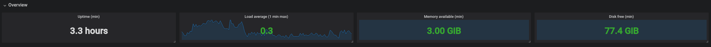
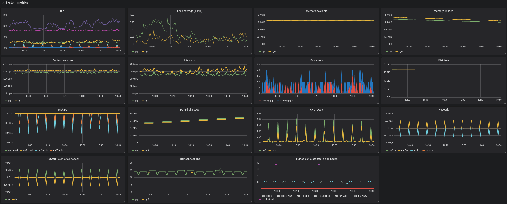
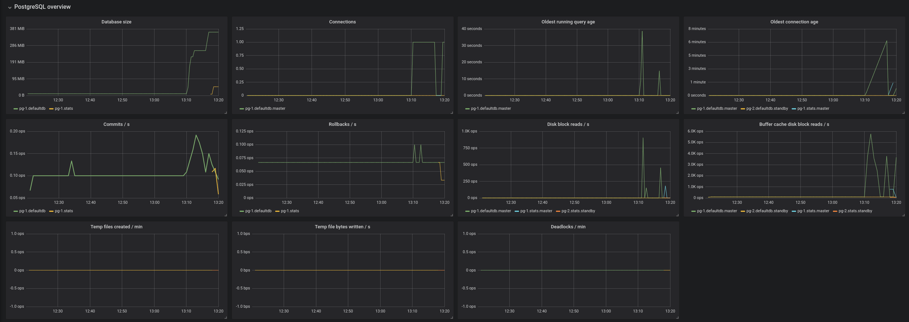
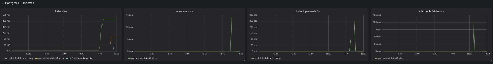
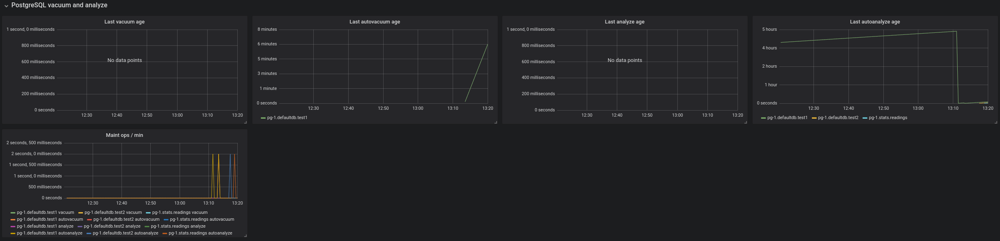
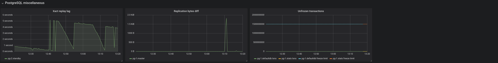

Built-in Aiven PostgreSQL Grafana dashboard
===========================================

What graphs and values are included in the default Grafana dashboard in the Aiven metrics integration

When you enable the metrics/dashboard integration, Aiven automatically creates a default PostgreSQL dashboard in Grafana that shows useful metrics. For more information on enabling the integration, see `this article <https://help.aiven.io/services/getting-started-with-service-integrations>`_.

A few key points about the default dashboards:

1. The dashboards show all tables and indexes for all logical databases, because they cannot determine which tables or indexes are relevant and which are not. This may increase the complexity of graphs for large deployments.
2. Some metrics are gathered but not shown in the default dashboard to avoid making it too hard to follow. These cases are detailed later. 
3. You can create new dashboards that include your preferred set of metrics and filter criteria to make them more useful to you. Copy the default dashboard to use as a template to make the process easier.
4. When you create new dashboards, do not start their names with “Aiven” because they may be removed or replaced. The "Aiven" prefix is used to identify system-managed dashboards. This also applies to the default dashboard, which you should edit directly because the changes will be lost at some point.

The default dashboard is split into multiple sections under two larger categories: Generic and PostgreSQL.

Generic metrics
---------------

The dashboard includes quite a lot of metrics that are not specific to the type of service running on the node. These are mostly related to CPU, memory, disk, and network information.

Overview
--------

This section shows a high-level overview of the service node health. Major issues with the service are often visible directly in this section. 

**Note:** The figures for Business and Premium services are averages of all nodes that belong to the service. For some metrics, such as disk space, this typically does not matter, but loads are usually concentrated on the primary node (or in certain setups the standby nodes) and high values are dampened by the average. Node-specific values are shown in the *system metrics* section.

``Uptime``: The time the service has been up and running.

``Load average``: The number of processes that would want to run. 
**Note:** If this number is higher than the number of CPUs on the nodes, the service may be underprovisioned.

``Memory available``: Memory not allocated by running processes.

``Disk free``: Amount of unused disk space.

System metrics
--------------

This section shows a more detailed listing of various generic (non-PostgreSQL) system-related metrics.

``CPU``: System, user, iowait, and interrupt request (IRQ) CPU usage. A high iowait means that the system is writing or reading too much data to or from disk.

``Load average``: The number of processes that would want to run. 
**Note:** If this number is higher than the number of CPUs on the node, the service may be underprovisioned.

``Memory available``: The amount of memory not allocated by running processes.

``Memory unused``: The amount of memory not allocated by running processes or used for buffer caches.

``Context switches``: The number of switches from one process or thread to another.

``Interrupts``: The number of interrupts per second.

``Processes``: The number of processes that are actively doing something. Processes that are mostly idle are not included.

``Disk free``: The current amount of remaining disk space. 
**Tip:** Actively monitor this value and associate it with an alert. The database will stop working correctly if it runs out of disk space.

``Disk i/o``: The number of bytes read and written per second on each of the nodes.

``Data disk usage``: The amount of disk space that is in use on the service's data disk.

``CPU iowait``: The percentage of CPU time spent waiting for the disk to become available for read and write operations. This number is also reported in the general CPU usage, but it is important enough to have its own graph.
**Tip:** Create an alert that is triggered when iowait goes beyond a certain threshold for an extended time. This gives you an opportunity to respond quickly when the database starts to slow down from too many read and write operations.

``Network``: The number of inbound and outbound bytes per second for a node.

``Network (sum of all nodes)``: The same as the network graph, but values are not grouped by service node.

``TCP connections``: The number of open TCP connections, grouped by node.

``TCP socket state total on all nodes``: The number of TCP connections across all service nodes, grouped by the TCP connection state.

PostgreSQL-specific metrics
---------------------------

For most metrics, the metric name identifies the internal PostgreSQL statistics view. See the `PostgreSQL documentation <https://www.postgresql.org/docs/10/static/monitoring-stats.html>`_ for more detailed explanations of the various metric values.

Metrics that are currently recorded but not shown in the default dashboard include ``postgresql.pg_stat_bgwriter`` and ``postgresql.pg_class`` metrics as a whole, as well as some individual values from other metrics.

Overview
--------

The metrics in the PostgreSQL overview section are grouped by logical database. In addition, some metrics are grouped by host.

``Database size``: The size of the files associated with a logical database. 
**Note:** There are some potentially large files that are not included in this value. Most notably, the write-ahead log (WAL) is not included in the size of the logical databases as it is not tied to any specific logical database.

``Connections:`` The number of open connections to the database. 
**Note:** Each connection puts a large burden on the PostgreSQL server and this number `should typically be fairly small even for large plans <https://help.aiven.io/postgresql/operations/postgresql-connection-limits>`_. Use connection pooling to `reduce the number of connections <https://help.aiven.io/postgresql/operations/postgresql-connection-pooling>`_ to the actual database server.

``Oldest running query age``: The age of the oldest running query. 
**Tip:** Typical queries run in milliseconds, and having queries that run for minutes often indicates an issue.

``Oldest connection age``: The age of the oldest connection. Old open connections with open transactions are a problem, because they prevent ``VACUUM`` from performing correctly, resulting in bloat and performance degradation.

``Commits / s``: The number of commits per second.

``Rollbacks / s``: The number of rollbacks per second.

``Disk block reads / s``: The number of 8 kB disk blocks that PostgreSQL reads per second, excluding reads that were satisfied by the buffer cache. The read operations may have been satisfied by the operating system's file system cache.

``Buffer cache disk block reads / s``: The number of 8 kB disk blocks that PostgreSQL reads per second that were already in buffer cache.

``Temp files created / min``: The number of temporary files that PostgreSQL created per minute. Temporary files are usually created when a query requests a large result set that needs to be sorted or when a query joins large result sets. 
**Tip**: Temporary files only need to be created when the results are too large to fit into memory and a high number of temporary files or temporary file bytes may indicate that you should increase the working memory setting. You could also consider optimizing the queries that cause temporary files to make the temporary result sets smaller, or add an index to allow sorting directly based on the index.

``Temp file bytes written / s``: The number of bytes written to temporary files per second. 
**Tip:** This value should be kept at reasonable levels to avoid the server becoming IO-bound from having to write so much data to temporary files.

``Deadlocks / min``: The number of deadlocks per minute. Deadlocks occur when different transactions obtain row-level locks for two or more of the same rows in a different order. 
**Note:** You can resolve deadlock situations by retrying the transactions on the client side, but deadlocks can create significant bottlenecks and high counts are something that you should investigate. 
**Tip:** Use ``SELECT … ORDER BY … FOR UPDATE`` to ensure that rows are locked in the desired order.

Indexes
-------

This section contains graphs related to the size and use of indexes. Because the default dashboard contains all indexes in all logical databases, it is easily convoluted for complex databases. 

You might want to make a copy of the default dashboard and add additional constraints for the graphs to filter out uninteresting indexes. For example, for the size graph, you might want to include only indexes that are above ``X`` megabytes in size.

``Index size``: The size of indexes on disk.

``Index scans / s``: The number of scans per second per index.

``Index tuple reads / s``: The number or tuples read from an index during index scans.

``Index tuple fetches / s``: The number of table rows fetched during index scans.

Tables
------

This section contains graphs related to the size and use of tables. As with indexes, the graph will be convoluted for complex databases, and you may want to make a copy of the dashboard to add additional filters that exclude uninteresting tables.

``Table size``: The size of tables, excluding indexes and TOAST data.

``Table size total``: The total size of tables, including indexes and TOAST data.

``Table seq scans / s``: The number of sequential scans per table per second. 
**Tip:** For small tables, sequential scans may be the best way of accessing the table data and having a lot of sequential scans may be normal, but for larger tables, sequential scans should be very rare.

``Table tuple inserts / s``: The number of tuples inserted per second.

``Table tuple updates / s``: The number of tuples updated per second.

``Table tuple deletions / s``: The number of tuples deleted per second.

``Table dead tuples``: The number of rows that have become unreferenced due to an update or deletion for the same row, and uncommitted transactions older than the update or delete operation are no longer running. The rows will be marked reusable during the next ``VACUUM``. 
**Tip:** High values here may indicate that vacuuming is not aggressive enough. Consider adjusting its configuration to make it run more often, because frequent vacuums reduce table bloat and make the system work better. 
**Note:** The ``n_live_tup`` value is available and can be used to create graphs that show tables with high ratios of dead and live tuples.

``Table modifications since analyze``: The number of inserts, updates, or deletions since the last ``ANALYZE`` operation. 
**Note:** A high number here means that the query planner may end up creating bad query plans because it is operating on obsolete data. 
**Tip:** Vacuuming also performs ``ANALYZE``, and you may want to adjust your vacuum settings if you see slow queries and high table modification counts for the related tables.

Vacuum and analyze
------------------

This section contains graphs related to vacuum and analyze operations. The graphs are grouped by table and, for complex databases, you probably want to add additional filter criteria to only show results where values are outside the expected range.

``Last vacuum age``: Time since the last manual vacuum operation for a table.

``Last autovacuum age``: Time since the last automatic vacuum operation for a table.

``Last analyze age``: Time since the last manual analyze operation for a table.

``Last autoanalyze age``: Time since last automatic analyze operation for a table.

``Maint ops / min``: The number of vacuum and analyze operations per table, per minute.

Miscellaneous
-------------

This section contains miscellaneous graphs.

``Xact replay lag``: The replication lag between primary and standby nodes.

``Replication bytes diff``: The replication lag in bytes. This is the total diff across all replication clients. 
**Tip:** To differentiate between different standby nodes, you can additionally group by the ``client_addr`` tag. This graph shows a diff based on ``write_lsn``; ``flush_lsn`` is also available.

``Unfrozen transactions``: The number of transactions that have not been frozen as well as the freeze limit. 
**Note:** In very busy systems, the number of transactions that have not been frozen by vacuum operations may rise rapidly and you should monitor this value to ensure the freeze limit is not reached. Reaching the limit causes the system to stop working. If the ``txns`` values get close to the freeze limit, vacuum settings need to be made more aggressive, and you must resolve any problems that prevent vacuum operations from completing, such as long-running open transactions.

