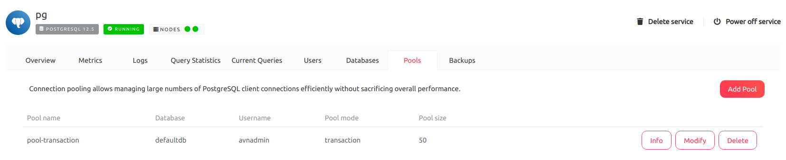

Basic PostgreSQL best practices
===============================

Tips on how to get the most out of your PostgreSQL service

Identify and optimize slow queries
----------------------------------

It's a good idea to check the **Query Statistics** tab for your service in the Aiven Console to find queries that are taking a long time to run or are running particularly often. Alternatively, use the ``pg_stat_statements`` query in ``psql``).

When you have identified slow queries, you can inspect the query plan and execution using ``EXPLAIN ANALYZE`` to see if you need to add any missing indexes or restructure your schema to improve the performance.

Note that too many database indexes on a table can also cause problems for write performance due to the overhead of maintaining them.

Use connection pooling to handle an increase in database connections
--------------------------------------------------------------------

When your application code scales horizontally to accommodate high loads, you might find that you inadvertently reach the `connection limit <495879.html>`_ for your plan. Each connection in PostgreSQL runs in a separate process, and this makes them more expensive (compared to threads, for example) in terms of interprocess communication and memory usage, since each connection consumes a certain amount of RAM.

The most effective solution to support a large number of connections is to use Aiven connection pooling which is implemented using `PgBouncer <https://www.pgbouncer.org/>`_. You can add and configure the connection pooling for your service on the **Pools** tab in the Aiven console.

Move read-only queries to standby nodes
---------------------------------------

If your service is running a ``business-*`` or ``premium-*`` plan, you have standby nodes available in a high availability setup. These `support read-only queries <595206.html>`_ by direct connections to the ``Read-only replica URL`` to reduce the effect of slow queries on the primary node.

Move read-only queries to a remote read replica
-----------------------------------------------

We also offer the option to create a `remote read replica <1755229.html>`_ service that can be set up in the same cloud and region or in a different one. This provides a dedicated read-only service that you can use to reduce the load on the main service if it is under heavy write load.
